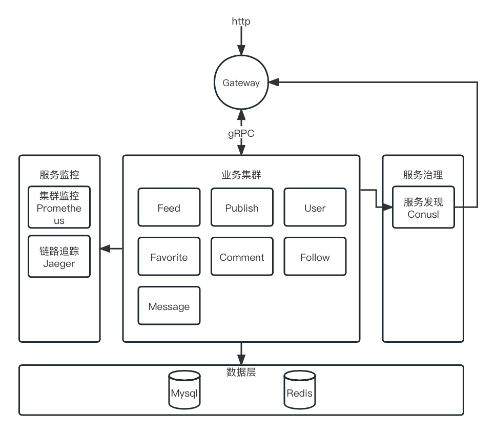

## 字节跳动青训营项目——极简版抖音

第五届字节跳动青训营大项目，实现极简版抖音后台

## 技术栈

该项目使用Go语言进行开发，Go-zero作为微服务框架

1. 服务注册与发现：Consul
2. 服务网关：Go-zero生成
3. 服务调用：gRPC
4. 服务监控：Prometheus
5. 数据库交互：Gorm

## 项目功能

基础功能：视频Feed流、视频投稿、用户中心

互动功能：点赞、评论

社交功能：关注、收发消息

## 整体架构



项目整体可分为八个模块：

1. 网关Gateway：验证请求、鉴权、缓存、数据转换、服务调用、负载均衡
2. 视频流Feed：获取视频流
3. 发布Publish：视频投稿、发布列表
4. 用户User：用户注册、登陆、信息
5. 点赞Favorite：点赞、取消点赞、点赞列表
6. 评论Comment：发布评论，删除评论
7. 关注Follow：关注用户、取消关注、关注列表
8. 消息Message：发送消息、接收消息

## 启动项目

启动Consul、Mysql、Redis并配置

```shell
consul agent -dev
```

启动Feed服务  

```shell
cd apps/feed && go run feed.go
```

启动Publish服务

```shell
cd apps/feed && go run feed.go
```

启动User服务

```shell
cd apps/user && go run user.go
```

启动Favorite服务

```shell
cd apps/favorite && go run favorite.go
```

启动Comment服务

```shell
cd apps/comment && go run comment.go
```

启动Follow服务

```shell
cd apps/follow && go run follow.go
```

启动Message服务

```shell
cd apps/message && go run message.go
```

启动Gateway

```shell
cd apps/gateway && go run gateway.go
```

